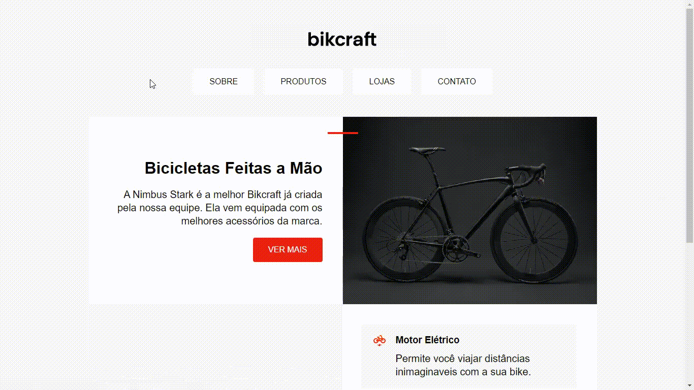

## Description
Um mini projeto em HTML e CSS que acompanha a mnha evolução no aprofundamento dos conhecimentos em web design durante o decorrer do curso HTML e CSS Para iniciantes, da plataforma Origamid. Foi uma ótima experiência para aperfeiçoar minhas habilidades e boas práticas em HTML e CSS, além absorver uma boa noção de web desig.

  

